# Schéma de Base de Données PostgreSQL - Application SaaS de Gestion Comptable

**Version:** 1.0
**Date:** 2026-09-13
**Auteur:** Architecture Technique
**Base de données:** PostgreSQL 14+
**Stratégie de stockage:** Multi-tenant par partage de schema (shared-schema) avec `organization_id` partout

---

## Table des matieres

1. [Diagramme entite-relation](#1-diagramme-entite-relation)
2. [Tables du systeme](#2-tables-du-systeme)
3. [Tables de l'organisation](#3-tables-de-lorganisation)
4. [Tables comptables et financieres](#4-tables-comptables-et-financieres)
5. [Tables d'abonnement et de paiements](#5-tables-dabonnement-et-paiements)
6. [Tables d'audit et de surveillance](#6-tables-daudit-et-de-surveillance)
7. [Tables d'integration et d'automatisation](#7-tables-dintegration-et-dautomatisation)
8. [Strategies d'index](#8-strategies-dindex)
9. [Relations et comportement des cles etrangeres](#9-relations-et-comportement-des-cl-etrangeres)
10. [Partage multi-tenant](#10-partage-multi-tenant)
11. [Partitionnement](#11-partitionnement)
12. [Script SQL de creation](#12-script-sql-de-creation)
13. [Bonnes pratiques](#13-bonnes-pratiques)

---
---

## 1. Diagramme entite-relation

### 1.1 Diagramme Mermaid

```mermaid
erDiagram
    USERS ||--o{ USER_ORGANIZATIONS : "appartient a"
    ORGANIZATIONS ||--o{ USER_ORGANIZATIONS : "a des membres"
    ORGANIZATIONS ||--o{ ACCOUNTS : "possede"
    ORGANIZATIONS ||--o{ TRANSACTIONS : "a des ecritures"
    ORGANIZATIONS ||--o{ INVOICES : "emet"
    ORGANIZATIONS ||--o{ QUOTES : "emet"
    ORGANIZATIONS ||--o{ PAYMENTS : "recoit"
    ORGANIZATIONS ||--o{ SUBSCRIPTIONS : "a un abonnement"
    ORGANIZATIONS ||--o{ TAX_DECLARATIONS : "declare"
    ORGANIZATIONS ||--o{ BUDGETS : "definit"
    ORGANIZATIONS ||--o{ RECURRING_EXPENSES : "programme"
    ORGANIZATIONS ||--o{ FINANCIAL_STATEMENTS : "produit"
    ORGANIZATIONS ||--o{ NOTIFICATIONS : "envoie"
    ORGANIZATIONS ||--o{ ALERTS : "declenche"
    ORGANIZATIONS ||--o{ DASHBOARD_METRICS : "calcule"
    ORGANIZATIONS ||--o{ CASH_FLOW_PROJECTIONS : "projette"
    ORGANIZATIONS ||--o{ CHART_OF_ACCOUNTS : "definit"
    ORGANIZATIONS ||--o{ BANK_CONNECTIONS : "connecte"
    ORGANIZATIONS ||--o{ OCR_JOBS : "traite"
    ORGANIZATIONS ||--o{ FEC_EXPORTS : "exporte"
    ORGANIZATIONS ||--o{ AUDIT_LOGS : "enregistre"

    ACCOUNT_CATEGORIES ||--o{ ACCOUNTS : "categorise"
    CHART_OF_ACCOUNTS ||--o{ ACCOUNT_CATEGORIES : "structure"
    CHART_OF_ACCOUNTS ||--o{ ACCOUNTS : "definit les comptes"

    TRANSACTION_CATEGORIES ||--o{ TRANSACTIONS : "categorise"
    INVOICE_ITEMS }o--|| INVOICES : "appartient a"
    QUOTE_ITEMS }o--|| QUOTES : "appartient a"
    PAYMENT_METHODS ||--o{ PAYMENTS : "utilise"
    SUBSCRIPTION_PLANS ||--o{ SUBSCRIPTIONS : "offre"
    TAXES ||--o{ TAX_DECLARATIONS : "applique"
    TAXES ||--o{ INVOICE_ITEMS : "applique"

    USERS ||--o{ AUDIT_LOGS : "action"
    USERS ||--o{ NOTIFICATIONS : "recoit"
    USERS ||--o{ USER_ORGANIZATIONS : "est membre de"

    INVOICES ||--o{ PAYMENTS : "recoit"
    INVOICES ||--o{ INVOICE_ITEMS : "contient"
    QUOTES ||--o{ QUOTE_ITEMS : "contient"

    BANK_CONNECTIONS ||--o{ OCR_JOBS : "declenche"
    BANK_CONNECTIONS ||--o{ TRANSACTIONS : "importe"
    TRANSACTIONS ||--o{ AUDIT_LOGS : "genere"
    FINANCIAL_STATEMENTS ||--o{ FEC_EXPORTS : "source"
    SUBSCRIPTIONS ||--o{ PAYMENTS : "facture"
    RECURRING_EXPENSES ||--o{ TRANSACTIONS : "genere"
    BUDGETS ||--o{ TRANSACTION_CATEGORIES : "alloue"
    ALERTS ||--o{ NOTIFICATIONS : "declenche"
```



### 1.2 Diagramme ASCII simplifie

```
┌──────────────────┐     ┌──────────────────────┐     ┌─────────────────────┐
│     USERS        │────▶│ USER_ORGANIZATIONS   │◀────│  ORGANIZATIONS      │
│  (auth 2FA)      │     │  (RBAC roles)       │     │  (entreprises)      │
└──────────────────┘     └──────────────────────┘     └──────────┬──────────┘
       │                                                        │
       │                   ┌──────────────────────┐            │
       └──────────────────▶│    AUDIT_LOGS        │◀─────────────┘
                           │  (piste d'audit)     │
                           └──────────────────────┘
                                    │
                                    │
        ┌───────────────────────────┼───────────────────────────┐
        │                           │                           │
        ▼                           ▼                           ▼
┌──────────────┐     ┌─────────────────────┐     ┌─────────────────────┐
│  ACCOUNTS    │     │   TRANSACTIONS      │     │   INVOICES          │
│  (bancaires/ │     │  (ecritures compt.)  │     │   (factures)        │
│   comptables)│     └─────────┬───────────┘     └──────────┬──────────┘
└──────┬───────┘             │                           │
       │                     │                           │
       ▼                     ▼                           ▼
┌──────────────┐     ┌─────────────────────┐     ┌─────────────────────┐
│ CHART_OF_    │     │ TRANSACTION_CATEGORIES│   │  INVOICE_ITEMS      │
│ ACCOUNTS     │     │ (categories dep./rev.) │   │  (lignes de facture)│
│ (plan compt.)│     └─────────────────────┘     └─────────────────────┘
└──────────────┘
```

---
---

## 2. Tables du systeme (Core)

### 2.1 users -- Utilisateurs avec authentification 2FA

```sql
CREATE TABLE users (
    id                  UUID PRIMARY KEY DEFAULT gen_random_uuid(),
    email               VARCHAR(255)    NOT NULL UNIQUE,
    email_verified      BOOLEAN         NOT NULL DEFAULT false,
    password_hash       VARCHAR(255)    NOT NULL,
    password_changed_at TIMESTAMPTZ,
    first_name          VARCHAR(100)    NOT NULL,
    last_name           VARCHAR(100)    NOT NULL,
    phone               VARCHAR(20),
    avatar_url          TEXT,
    locale              VARCHAR(5)      NOT NULL DEFAULT 'fr',
    timezone            VARCHAR(50)     NOT NULL DEFAULT 'Europe/Paris',
    two_factor_enabled  BOOLEAN         NOT NULL DEFAULT false,
    two_factor_secret    VARCHAR(32),
    two_factor_backup_codes TEXT[],
    mfa_method          VARCHAR(20)     NOT NULL DEFAULT 'none'
                        CHECK (mfa_method IN ('none', 'totp', 'webauthn', 'sms')),
    webauthn_credential JSONB,
    is_active           BOOLEAN         NOT NULL DEFAULT true,
    is_superadmin       BOOLEAN         NOT NULL DEFAULT false,
    last_login_at       TIMESTAMPTZ,
    last_login_ip       INET,
    failed_login_count  INTEGER         NOT NULL DEFAULT 0,
    locked_until        TIMESTAMPTZ,
    created_at          TIMESTAMPTZ     NOT NULL DEFAULT now(),
    updated_at          TIMESTAMPTZ     NOT NULL DEFAULT now(),
    deleted_at          TIMESTAMPTZ
);

CREATE INDEX idx_users_email ON users (email);
CREATE INDEX idx_users_active ON users (is_active) WHERE is_active = true;
CREATE INDEX idx_users_last_login ON users (last_login_at DESC);
CREATE INDEX idx_users_deleted ON users (deleted_at) WHERE deleted_at IS NULL;

COMMENT ON TABLE users IS 'Utilisateurs de la plateforme avec authentification 2FA';
COMMENT ON COLUMN users.two_factor_secret IS 'Secret TOTP en base32 pour Google Authenticator';
COMMENT ON COLUMN users.two_factor_backup_codes IS 'Codes de secours hashes (bcrypt) pour deverrouillage';
COMMENT ON COLUMN users.webauthn_credential IS 'Credentials WebAuthn (cle physique FIDO2)';
```

### 2.2 organizations -- Entreprises / Clients

```sql
CREATE TABLE organizations (
    id                  UUID PRIMARY KEY DEFAULT gen_random_uuid(),
    name                VARCHAR(255)    NOT NULL,
    legal_name          VARCHAR(255),
    siret               VARCHAR(14),
    siren               VARCHAR(9),
    vat_number          VARCHAR(20),
    rcs_number          VARCHAR(20),
    address_line1       VARCHAR(255),
    address_line2       VARCHAR(255),
    postal_code         VARCHAR(10),
    city                VARCHAR(100),
    country             CHAR(2)         NOT NULL DEFAULT 'FR'
                        CHECK (country ~ '^[A-Z]{2}$'),
    phone               VARCHAR(20),
    email               VARCHAR(255),
    website             VARCHAR(255),
    logo_url            TEXT,
    currency            VARCHAR(3)      NOT NULL DEFAULT 'EUR'
                        CHECK (currency ~ '^[A-Z]{3}$'),
    fiscal_year_start   INTEGER         NOT NULL DEFAULT 1
                        CHECK (fiscal_year_start BETWEEN 1 AND 12),
    date_format         VARCHAR(10)     NOT NULL DEFAULT 'DD/MM/YYYY',
    number_format       VARCHAR(10)     NOT NULL DEFAULT '1.234,56',
    created_at          TIMESTAMPTZ     NOT NULL DEFAULT now(),
    updated_at          TIMESTAMPTZ     NOT NULL DEFAULT now(),
    deleted_at          TIMESTAMPTZ
);

CREATE INDEX idx_organizations_name ON organizations (name);
CREATE INDEX idx_organizations_siret ON organizations (siret);
CREATE INDEX idx_organizations_vat ON organizations (vat_number);
CREATE INDEX idx_organizations_deleted ON organizations (deleted_at) WHERE deleted_at IS NULL;

COMMENT ON TABLE organizations IS 'Entreprises clients de la plateforme SaaS';
COMMENT ON COLUMN organizations.siret IS 'Numéro SIRET a 14 chiffres (identifiant etablissement)';
COMMENT ON COLUMN organizations.vat_number IS 'Numéro de TVA intracommunautaire (format EU)';
```

### 2.3 user_organizations -- Membres avec roles RBAC

```sql
CREATE TABLE user_organizations (
    id                  UUID PRIMARY KEY DEFAULT gen_random_uuid(),
    user_id             UUID           NOT NULL REFERENCES users(id) ON DELETE CASCADE,
    organization_id     UUID           NOT NULL REFERENCES organizations(id) ON DELETE CASCADE,
    role                VARCHAR(50)    NOT NULL DEFAULT 'member'
                        CHECK (role IN ('owner', 'admin', 'accountant', 'auditor', 'member', 'viewer')),
    permissions         JSONB          NOT NULL DEFAULT '{}',
    is_active           BOOLEAN        NOT NULL DEFAULT true,
    invited_by          UUID           REFERENCES users(id) ON DELETE SET NULL,
    invited_at          TIMESTAMPTZ,
    accepted_at         TIMESTAMPTZ,
    created_at          TIMESTAMPTZ    NOT NULL DEFAULT now(),
    updated_at          TIMESTAMPTZ    NOT NULL DEFAULT now(),
    UNIQUE (user_id, organization_id)
);

CREATE INDEX idx_user_org_user ON user_organizations (user_id);
CREATE INDEX idx_user_org_org ON user_organizations (organization_id);
CREATE INDEX idx_user_org_role ON user_organizations (organization_id, role);
CREATE INDEX idx_user_org_active ON user_organizations (organization_id, is_active) WHERE is_active = true;

COMMENT ON TABLE user_organizations IS 'Relation many-to-many utilisateurs-organisations avec roles RBAC';
COMMENT ON COLUMN user_organizations.permissions IS 'Permissions granulaires par role (JSONB)';
```

---
---

## 3. Tables comptables (Chart of Accounts & Accounts)

### 3.1 account_categories -- Categories de comptes

```sql
CREATE TABLE account_categories (
    id                  UUID PRIMARY KEY DEFAULT gen_random_uuid(),
    organization_id     UUID           NOT NULL REFERENCES organizations(id) ON DELETE CASCADE,
    parent_id           UUID           REFERENCES account_categories(id) ON DELETE CASCADE,
    name                VARCHAR(100)   NOT NULL,
    code                VARCHAR(10),
    type                VARCHAR(20)    NOT NULL
                        CHECK (type IN ('asset', 'liability', 'equity', 'revenue', 'expense')),
    description         TEXT,
    is_active           BOOLEAN        NOT NULL DEFAULT true,
    created_at          TIMESTAMPTZ    NOT NULL DEFAULT now(),
    updated_at          TIMESTAMPTZ    NOT NULL DEFAULT now()
);

CREATE INDEX idx_ac_org ON account_categories (organization_id);
CREATE INDEX idx_ac_parent ON account_categories (parent_id);
CREATE INDEX idx_ac_type ON account_categories (organization_id, type);

COMMENT ON TABLE account_categories IS 'Categories de comptes (classes 1 a 8 du plan comptable)';
```

### 3.2 chart_of_accounts -- Plan comptable personnalise

```sql
CREATE TABLE chart_of_accounts (
    id                  UUID PRIMARY KEY DEFAULT gen_random_uuid(),
    organization_id     UUID           NOT NULL REFERENCES organizations(id) ON DELETE CASCADE,
    account_number      VARCHAR(10)    NOT NULL,
    name                VARCHAR(255)   NOT NULL,
    category_id         UUID           REFERENCES account_categories(id) ON DELETE SET NULL,
    type                VARCHAR(20)    NOT NULL
                        CHECK (type IN ('asset', 'liability', 'equity', 'revenue', 'expense')),
    parent_account_id  UUID           REFERENCES chart_of_accounts(id) ON DELETE CASCADE,
    is_active           BOOLEAN        NOT NULL DEFAULT true,
    is_system           BOOLEAN        NOT NULL DEFAULT false,
    created_at          TIMESTAMPTZ    NOT NULL DEFAULT now(),
    updated_at          TIMESTAMPTZ    NOT NULL DEFAULT now(),
    UNIQUE (organization_id, account_number)
);

CREATE INDEX idx_coa_org ON chart_of_accounts (organization_id);
CREATE INDEX idx_coa_number ON chart_of_accounts (organization_id, account_number);
CREATE INDEX idx_coa_parent ON chart_of_accounts (parent_account_id);
CREATE INDEX idx_coa_type ON chart_of_accounts (organization_id, type);

COMMENT ON TABLE chart_of_accounts IS 'Plan comptable personnalise par organisation';
```

### 3.3 accounts -- Comptes bancaires et comptables

```sql
CREATE TABLE accounts (
    id                  UUID PRIMARY KEY DEFAULT gen_random_uuid(),
    organization_id     UUID           NOT NULL REFERENCES organizations(id) ON DELETE CASCADE,
    chart_account_id    UUID           REFERENCES chart_of_accounts(id) ON DELETE SET NULL,
    name                VARCHAR(255)   NOT NULL,
    account_type        VARCHAR(30)    NOT NULL
                        CHECK (account_type IN ('bank', 'cash', 'credit_card', 'paypal', 'crypto', 'other')),
    iban                VARCHAR(34),
    bic                 VARCHAR(11),
    bank_name           VARCHAR(100),
    account_number      VARCHAR(50),
    currency            VARCHAR(3)     NOT NULL DEFAULT 'EUR',
    current_balance     NUMERIC(15,2)  NOT NULL DEFAULT 0,
    opening_balance     NUMERIC(15,2)  NOT NULL DEFAULT 0,
    opening_date        DATE,
    is_active           BOOLEAN        NOT NULL DEFAULT true,
    is_archived         BOOLEAN        NOT NULL DEFAULT false,
    external_id         VARCHAR(100),
    metadata            JSONB,
    created_at          TIMESTAMPTZ    NOT NULL DEFAULT now(),
    updated_at          TIMESTAMPTZ    NOT NULL DEFAULT now(),
    deleted_at          TIMESTAMPTZ
);

CREATE INDEX idx_accounts_org ON accounts (organization_id);
CREATE INDEX idx_accounts_type ON accounts (organization_id, account_type);
CREATE INDEX idx_accounts_active ON accounts (organization_id, is_active) WHERE is_active = true;
CREATE INDEX idx_accounts_external ON accounts (external_id);
CREATE INDEX idx_accounts_chart ON accounts (chart_account_id);

COMMENT ON TABLE accounts IS 'Comptes de tresorerie: bancaires, espaces, cartes, etc.';
COMMENT ON COLUMN accounts.iban IS 'IBAN normalise (sans espaces)';
COMMENT ON COLUMN accounts.current_balance IS 'Solde actuel en unites de monnaie';
```

---
---

## 4. Transactions et categories

### 4.1 transaction_categories -- Categories de depenses / revenus

```sql
CREATE TABLE transaction_categories (
    id                  UUID PRIMARY KEY DEFAULT gen_random_uuid(),
    organization_id     UUID           NOT NULL REFERENCES organizations(id) ON DELETE CASCADE,
    parent_id           UUID           REFERENCES transaction_categories(id) ON DELETE CASCADE,
    name                VARCHAR(100)   NOT NULL,
    code                VARCHAR(20),
    type                VARCHAR(10)    NOT NULL CHECK (type IN ('income', 'expense')),
    color                VARCHAR(7),
    icon                VARCHAR(50),
    is_system           BOOLEAN        NOT NULL DEFAULT false,
    is_active           BOOLEAN        NOT NULL DEFAULT true,
    created_at          TIMESTAMPTZ    NOT NULL DEFAULT now(),
    updated_at          TIMESTAMPTZ    NOT NULL DEFAULT now()
);

CREATE INDEX idx_tc_org ON transaction_categories (organization_id);
CREATE INDEX idx_tc_parent ON transaction_categories (parent_id);
CREATE INDEX idx_tc_type ON transaction_categories (organization_id, type);

COMMENT ON TABLE transaction_categories IS 'Categories de transactions (revenus/depenses)';
```

### 4.2 transactions -- Ecritures comptables

```sql
CREATE TABLE transactions (
    id                  UUID PRIMARY KEY DEFAULT gen_random_uuid(),
    organization_id     UUID           NOT NULL REFERENCES organizations(id) ON DELETE CASCADE,
    account_id          UUID           NOT NULL REFERENCES accounts(id) ON DELETE RESTRICT,
    category_id         UUID           REFERENCES transaction_categories(id) ON DELETE SET NULL,
    counterparty        VARCHAR(255),
    counterparty_iban   VARCHAR(34),
    reference           VARCHAR(100),
    label               VARCHAR(500)   NOT NULL,
    description         TEXT,
    amount              NUMERIC(15,2)  NOT NULL CHECK (amount != 0),
    currency            VARCHAR(3)     NOT NULL DEFAULT 'EUR',
    exchange_rate       NUMERIC(10,6)  NOT NULL DEFAULT 1,
    amount_base         NUMERIC(15,2)  GENERATED ALWAYS AS (ROUND(amount * exchange_rate, 2)) STORED,
    direction           VARCHAR(10)    NOT NULL CHECK (direction IN ('debit', 'credit')),
    transaction_date    DATE           NOT NULL,
    value_date          DATE,
    booking_date        TIMESTAMPTZ    NOT NULL DEFAULT now(),
    status              VARCHAR(20)    NOT NULL DEFAULT 'posted'
                        CHECK (status IN ('pending', 'posted', 'cancelled', 'reconciled')),
    source              VARCHAR(30)    NOT NULL DEFAULT 'manual'
                        CHECK (source IN ('manual', 'bank_feed', 'ocr', 'import', 'api')),
    external_id         VARCHAR(100),
    ocr_job_id          UUID           REFERENCES ocr_jobs(id) ON DELETE SET NULL,
    metadata            JSONB,
    created_by          UUID           REFERENCES users(id) ON DELETE SET NULL,
    updated_by          UUID           REFERENCES users(id) ON DELETE SET NULL,
    created_at          TIMESTAMPTZ    NOT NULL DEFAULT now(),
    updated_at          TIMESTAMPTZ    NOT NULL DEFAULT now(),
    deleted_at          TIMESTAMPTZ
);

CREATE INDEX idx_tx_org ON transactions (organization_id);
CREATE INDEX idx_tx_account ON transactions (account_id);
CREATE INDEX idx_tx_date ON transactions (organization_id, transaction_date DESC);
CREATE INDEX idx_tx_category ON transactions (category_id);
CREATE INDEX idx_tx_status ON transactions (organization_id, status);
CREATE INDEX idx_tx_amount ON transactions (organization_id, amount);
CREATE INDEX idx_tx_counterparty ON transactions (organization_id, counterparty);
CREATE INDEX idx_tx_source ON transactions (source);
CREATE INDEX idx_tx_external ON transactions (external_id);
CREATE INDEX idx_tx_deleted ON transactions (deleted_at) WHERE deleted_at IS NULL;
CREATE INDEX idx_tx_org_date_cat ON transactions (organization_id, transaction_date DESC, category_id);

COMMENT ON TABLE transactions IS 'Ecritures comptables (transactions bancaires)';
COMMENT ON COLUMN transactions.amount_base IS 'Montant converti en monnaie de reference (EUR)';
```

---
---

## 5. Factures, devis et paiements

### 5.1 invoices -- Factures

```sql
CREATE TABLE invoices (
    id                  UUID PRIMARY KEY DEFAULT gen_random_uuid(),
    organization_id     UUID           NOT NULL REFERENCES organizations(id) ON DELETE CASCADE,
    invoice_number      VARCHAR(50)    NOT NULL,
    invoice_prefix      VARCHAR(10)    NOT NULL DEFAULT 'FACT',
    status              VARCHAR(20)    NOT NULL DEFAULT 'draft'
                        CHECK (status IN ('draft', 'sent', 'paid', 'partially_paid', 'overdue', 'cancelled', 'refunded')),
    customer_name       VARCHAR(255)   NOT NULL,
    customer_email      VARCHAR(255),
    customer_address    TEXT,
    customer_vat_number VARCHAR(20),
    issue_date          DATE           NOT NULL,
    due_date            DATE           NOT NULL,
    paid_at             TIMESTAMPTZ,
    subtotal            NUMERIC(15,2)  NOT NULL DEFAULT 0,
    discount_amount     NUMERIC(15,2)  NOT NULL DEFAULT 0,
    tax_amount          NUMERIC(15,2)  NOT NULL DEFAULT 0,
    total               NUMERIC(15,2)  NOT NULL DEFAULT 0,
    total_paid          NUMERIC(15,2)  NOT NULL DEFAULT 0,
    currency            VARCHAR(3)     NOT NULL DEFAULT 'EUR',
    notes               TEXT,
    terms               TEXT,
    pdf_url             TEXT,
    external_id         VARCHAR(100),
    created_by          UUID           REFERENCES users(id) ON DELETE SET NULL,
    updated_by          UUID           REFERENCES users(id) ON DELETE SET NULL,
    created_at          TIMESTAMPTZ    NOT NULL DEFAULT now(),
    updated_at          TIMESTAMPTZ    NOT NULL DEFAULT now(),
    deleted_at          TIMESTAMPTZ,
    UNIQUE (organization_id, invoice_number)
);

CREATE INDEX idx_inv_org ON invoices (organization_id);
CREATE INDEX idx_inv_number ON invoices (organization_id, invoice_number);
CREATE INDEX idx_inv_status ON invoices (organization_id, status);
CREATE INDEX idx_inv_dates ON invoices (organization_id, issue_date DESC);
CREATE INDEX idx_inv_due ON invoices (due_date) WHERE status IN ('sent', 'partially_paid', 'overdue');
CREATE INDEX idx_inv_customer ON invoices (organization_id, customer_name);

COMMENT ON TABLE invoices IS 'Factures emises par l organisation';
```

### 5.2 invoice_items -- Lignes de facture

```sql
CREATE TABLE invoice_items (
    id                  UUID PRIMARY KEY DEFAULT gen_random_uuid(),
    invoice_id          UUID           NOT NULL REFERENCES invoices(id) ON DELETE CASCADE,
    line_number         INTEGER        NOT NULL,
    product_code        VARCHAR(50),
    description         VARCHAR(500)   NOT NULL,
    quantity            NUMERIC(15,4)  NOT NULL DEFAULT 1 CHECK (quantity > 0),
    unit_price          NUMERIC(15,4)  NOT NULL,
    discount_percent    NUMERIC(5,2)   NOT NULL DEFAULT 0,
    tax_rate            NUMERIC(5,2)   NOT NULL DEFAULT 0,
    total               NUMERIC(15,2)  GENERATED ALWAYS AS (
        ROUND(quantity * unit_price * (1 - discount_percent / 100), 2)
    ) STORED,
    created_at          TIMESTAMPTZ    NOT NULL DEFAULT now()
);

CREATE INDEX idx_ii_invoice ON invoice_items (invoice_id);

COMMENT ON TABLE invoice_items IS 'Lignes de detail des factures';
COMMENT ON COLUMN invoice_items.tax_rate IS 'Taux de TVA en pourcentage (ex: 20.00 pour 20%)';
```

### 5.3 quotes -- Devis

```sql
CREATE TABLE quotes (
    id                  UUID PRIMARY KEY DEFAULT gen_random_uuid(),
    organization_id     UUID           NOT NULL REFERENCES organizations(id) ON DELETE CASCADE,
    quote_number        VARCHAR(50)    NOT NULL,
    status              VARCHAR(20)    NOT NULL DEFAULT 'draft'
                        CHECK (status IN ('draft', 'sent', 'accepted', 'rejected', 'expired')),
    customer_name       VARCHAR(255)   NOT NULL,
    customer_email      VARCHAR(255),
    customer_address    TEXT,
    issue_date          DATE           NOT NULL,
    valid_until         DATE           NOT NULL,
    subtotal            NUMERIC(15,2)  NOT NULL DEFAULT 0,
    discount_amount     NUMERIC(15,2)  NOT NULL DEFAULT 0,
    tax_amount          NUMERIC(15,2)  NOT NULL DEFAULT 0,
    total               NUMERIC(15,2)  NOT NULL DEFAULT 0,
    currency            VARCHAR(3)     NOT NULL DEFAULT 'EUR',
    notes               TEXT,
    pdf_url             TEXT,
    converted_to_invoice_id UUID REFERENCES invoices(id) ON DELETE SET NULL,
    created_by          UUID           REFERENCES users(id) ON DELETE SET NULL,
    created_at          TIMESTAMPTZ    NOT NULL DEFAULT now(),
    updated_at          TIMESTAMPTZ    NOT NULL DEFAULT now(),
    deleted_at          TIMESTAMPTZ,
    UNIQUE (organization_id, quote_number)
);

CREATE INDEX idx_qt_org ON quotes (organization_id);
CREATE INDEX idx_qt_status ON quotes (organization_id, status);
CREATE INDEX idx_qt_valid ON quotes (valid_until);
CREATE INDEX idx_qt_converted ON quotes (converted_to_invoice_id);

COMMENT ON TABLE quotes IS 'Devis emis avant facturation';
```

### 5.4 quote_items -- Lignes de devis

```sql
CREATE TABLE quote_items (
    id                  UUID PRIMARY KEY DEFAULT gen_random_uuid(),
    quote_id            UUID           NOT NULL REFERENCES quotes(id) ON DELETE CASCADE,
    line_number         INTEGER        NOT NULL,
    description         VARCHAR(500)   NOT NULL,
    quantity            NUMERIC(15,4)  NOT NULL DEFAULT 1 CHECK (quantity > 0),
    unit_price          NUMERIC(15,4)  NOT NULL,
    discount_percent    NUMERIC(5,2)   NOT NULL DEFAULT 0,
    tax_rate            NUMERIC(5,2)   NOT NULL DEFAULT 0,
    total               NUMERIC(15,2)  GENERATED ALWAYS AS (
        ROUND(quantity * unit_price * (1 - discount_percent / 100), 2)
    ) STORED,
    created_at          TIMESTAMPTZ    NOT NULL DEFAULT now()
);

CREATE INDEX idx_qi_quote ON quote_items (quote_id);
```

---
---

## 6. Paiements et abonnements

### 6.1 payment_methods -- Methodes de paiement

```sql
CREATE TABLE payment_methods (
    id                  UUID PRIMARY KEY DEFAULT gen_random_uuid(),
    organization_id     UUID           NOT NULL REFERENCES organizations(id) ON DELETE CASCADE,
    type                VARCHAR(30)    NOT NULL
                        CHECK (type IN ('card', 'bank_transfer', 'paypal', 'sepa', 'crypto', 'check', 'cash', 'other')),
    name                VARCHAR(100)   NOT NULL,
    is_default          BOOLEAN        NOT NULL DEFAULT false,
    is_active           BOOLEAN        NOT NULL DEFAULT true,
    encrypted_details   TEXT,
    external_provider   VARCHAR(50),
    external_id         VARCHAR(100),
    last4               VARCHAR(4),
    brand               VARCHAR(20),
    expiry_month        INTEGER CHECK (expiry_month BETWEEN 1 AND 12),
    expiry_year         INTEGER CHECK (expiry_year >= 2024),
    metadata            JSONB,
    created_at          TIMESTAMPTZ    NOT NULL DEFAULT now(),
    updated_at          TIMESTAMPTZ    NOT NULL DEFAULT now(),
    deleted_at          TIMESTAMPTZ
);

CREATE INDEX idx_pm_org ON payment_methods (organization_id);
CREATE INDEX idx_pm_type ON payment_methods (organization_id, type);
CREATE INDEX idx_pm_default ON payment_methods (organization_id, is_default) WHERE is_default = true;

COMMENT ON TABLE payment_methods IS 'Methodes de paiement enregistrees (carte, virement, etc.)';
```

### 6.2 payments -- Paiements

```sql
CREATE TABLE payments (
    id                  UUID PRIMARY KEY DEFAULT gen_random_uuid(),
    organization_id     UUID           NOT NULL REFERENCES organizations(id) ON DELETE CASCADE,
    invoice_id          UUID           REFERENCES invoices(id) ON DELETE SET NULL,
    subscription_id     UUID           REFERENCES subscriptions(id) ON DELETE SET NULL,
    payment_method_id   UUID           REFERENCES payment_methods(id) ON DELETE SET NULL,
    amount              NUMERIC(15,2)  NOT NULL CHECK (amount > 0),
    currency            VARCHAR(3)     NOT NULL DEFAULT 'EUR',
    exchange_rate       NUMERIC(10,6)  NOT NULL DEFAULT 1,
    amount_base         NUMERIC(15,2)  GENERATED ALWAYS AS (ROUND(amount * exchange_rate, 2)) STORED,
    status              VARCHAR(20)    NOT NULL DEFAULT 'pending'
                        CHECK (status IN ('pending', 'processing', 'completed', 'failed', 'refunded', 'partially_refunded')),
    payment_type        VARCHAR(30)    NOT NULL
                        CHECK (payment_type IN ('invoice', 'subscription', 'one_time', 'refund')),
    payment_date        TIMESTAMPTZ    NOT NULL DEFAULT now(),
    external_id         VARCHAR(100),
    external_status     VARCHAR(50),
    failure_reason      TEXT,
    metadata            JSONB,
    created_at          TIMESTAMPTZ    NOT NULL DEFAULT now(),
    updated_at          TIMESTAMPTZ    NOT NULL DEFAULT now()
);

CREATE INDEX idx_pay_org ON payments (organization_id);
CREATE INDEX idx_pay_invoice ON payments (invoice_id);
CREATE INDEX idx_pay_subscription ON payments (subscription_id);
CREATE INDEX idx_pay_method ON payments (payment_method_id);
CREATE INDEX idx_pay_status ON payments (organization_id, status);
CREATE INDEX idx_pay_date ON payments (payment_date DESC);
CREATE INDEX idx_pay_external ON payments (external_id);

COMMENT ON TABLE payments IS 'Paiements recus (factures, abonnements, etc.)';
```

### 6.3 subscription_plans -- Plans d abonnement

```sql
CREATE TABLE subscription_plans (
    id                  UUID PRIMARY KEY DEFAULT gen_random_uuid(),
    name                VARCHAR(100)   NOT NULL,
    description         TEXT,
    price               NUMERIC(15,2)  NOT NULL CHECK (price >= 0),
    currency            VARCHAR(3)     NOT NULL DEFAULT 'EUR',
    billing_interval    VARCHAR(10)    NOT NULL
                        CHECK (billing_interval IN ('monthly', 'quarterly', 'yearly')),
    trial_days          INTEGER        NOT NULL DEFAULT 0,
    features            JSONB          NOT NULL DEFAULT '[]',
    limits              JSONB          NOT NULL DEFAULT '{}',
    is_active           BOOLEAN        NOT NULL DEFAULT true,
    is_public           BOOLEAN        NOT NULL DEFAULT true,
    sort_order          INTEGER        NOT NULL DEFAULT 0,
    created_at          TIMESTAMPTZ    NOT NULL DEFAULT now(),
    updated_at          TIMESTAMPTZ    NOT NULL DEFAULT now()
);

CREATE INDEX idx_sp_active ON subscription_plans (is_active);
CREATE INDEX idx_sp_interval ON subscription_plans (billing_interval);

COMMENT ON TABLE subscription_plans IS 'Plans d abonnement SaaS (gratuit, pro, entreprise)';
```

### 6.4 subscriptions -- Abonnements organisation

```sql
CREATE TABLE subscriptions (
    id                  UUID PRIMARY KEY DEFAULT gen_random_uuid(),
    organization_id     UUID           NOT NULL REFERENCES organizations(id) ON DELETE CASCADE,
    plan_id             UUID           NOT NULL REFERENCES subscription_plans(id) ON DELETE RESTRICT,
    status              VARCHAR(20)    NOT NULL DEFAULT 'trial'
                        CHECK (status IN ('trial', 'active', 'past_due', 'cancelled', 'expired')),
    start_date          DATE           NOT NULL,
    trial_end           DATE,
    current_period_start DATE          NOT NULL,
    current_period_end  DATE           NOT NULL,
    cancelled_at        DATE,
    cancel_reason        TEXT,
    cancel_at_period_end BOOLEAN       NOT NULL DEFAULT false,
    payment_method_id   UUID           REFERENCES payment_methods(id) ON DELETE SET NULL,
    external_subscription_id VARCHAR(100),
    metadata            JSONB,
    created_at          TIMESTAMPTZ    NOT NULL DEFAULT now(),
    updated_at          TIMESTAMPTZ    NOT NULL DEFAULT now()
);

CREATE INDEX idx_sub_org ON subscriptions (organization_id);
CREATE INDEX idx_sub_plan ON subscriptions (plan_id);
CREATE INDEX idx_sub_status ON subscriptions (status);
CREATE INDEX idx_sub_external ON subscriptions (external_subscription_id);
CREATE INDEX idx_sub_period ON subscriptions (current_period_start, current_period_end);

COMMENT ON TABLE subscriptions IS 'Abonnement actuel d une organisation';
```

---
---

## 7. TVA (taxes)

### 7.1 taxes -- Taux de TVA

```sql
CREATE TABLE taxes (
    id                  UUID PRIMARY KEY DEFAULT gen_random_uuid(),
    organization_id     UUID           REFERENCES organizations(id) ON DELETE CASCADE,
    name                VARCHAR(100)   NOT NULL,
    rate                NUMERIC(5,2)   NOT NULL CHECK (rate >= 0 AND rate <= 100),
    type                VARCHAR(20)    NOT NULL DEFAULT 'vat'
                        CHECK (type IN ('vat', 'gst', 'sst', 'other')),
    country             CHAR(2),
    is_default          BOOLEAN        NOT NULL DEFAULT false,
    is_active           BOOLEAN        NOT NULL DEFAULT true,
    created_at          TIMESTAMPTZ    NOT NULL DEFAULT now(),
    updated_at          TIMESTAMPTZ    NOT NULL DEFAULT now()
);

CREATE INDEX idx_taxes_org ON taxes (organization_id);
CREATE INDEX idx_taxes_active ON taxes (organization_id, is_active) WHERE is_active = true;

COMMENT ON TABLE taxes IS 'Taux de TVA et autres taxes applicables';
COMMENT ON COLUMN taxes.rate IS 'Taux en pourcentage (ex: 20.00 pour 20%)';
```

### 7.2 tax_declarations -- Declarations TVA

```sql
CREATE TABLE tax_declarations (
    id                  UUID PRIMARY KEY DEFAULT gen_random_uuid(),
    organization_id     UUID           NOT NULL REFERENCES organizations(id) ON DELETE CASCADE,
    tax_id              UUID           REFERENCES taxes(id) ON DELETE SET NULL,
    period_type         VARCHAR(10)    NOT NULL
                        CHECK (period_type IN ('monthly', 'quarterly', 'yearly')),
    period_year         INTEGER        NOT NULL,
    period_month        INTEGER        CHECK (period_month IS NULL OR period_month BETWEEN 1 AND 12),
    period_quarter      INTEGER        CHECK (period_quarter IS NULL OR period_quarter BETWEEN 1 AND 4),
    start_date          DATE           NOT NULL,
    end_date            DATE           NOT NULL,
    status              VARCHAR(20)    NOT NULL DEFAULT 'draft'
                        CHECK (status IN ('draft', 'submitted', 'paid', 'late', 'cancelled')),
    total_sales         NUMERIC(15,2)  NOT NULL DEFAULT 0,
    total_purchases      NUMERIC(15,2)  NOT NULL DEFAULT 0,
    tax_collected       NUMERIC(15,2)  NOT NULL DEFAULT 0,
    tax_deductible      NUMERIC(15,2)  NOT NULL DEFAULT 0,
    tax_due             NUMERIC(15,2)  NOT NULL DEFAULT 0,
    declaration_number  VARCHAR(50),
    submission_date      DATE,
    due_date            DATE,
    paid_at             TIMESTAMPTZ,
    external_id         VARCHAR(100),
    metadata            JSONB,
    created_at          TIMESTAMPTZ    NOT NULL DEFAULT now(),
    updated_at          TIMESTAMPTZ    NOT NULL DEFAULT now()
);

CREATE INDEX idx_td_org ON tax_declarations (organization_id);
CREATE INDEX idx_td_period ON tax_declarations (organization_id, period_year, period_month);
CREATE INDEX idx_td_status ON tax_declarations (organization_id, status);

COMMENT ON TABLE tax_declarations IS 'Declarations de TVA periodiques';
COMMENT ON COLUMN tax_declarations.tax_due IS 'TVA due = collected - deductible';
```

---

## 8. Audit, notifications et alertes

### 8.1 audit_logs -- Piste d audit

```sql
CREATE TABLE audit_logs (
    id                  BIGSERIAL PRIMARY KEY,
    organization_id     UUID           REFERENCES organizations(id) ON DELETE CASCADE,
    user_id             UUID           REFERENCES users(id) ON DELETE SET NULL,
    action              VARCHAR(50)    NOT NULL,
    entity              VARCHAR(100)   NOT NULL,
    entity_id           UUID,
    ip_address          INET,
    user_agent          TEXT,
    method              VARCHAR(10),
    path                VARCHAR(500),
    status_code         INTEGER,
    changes             JSONB,
    old_values          JSONB,
    new_values          JSONB,
    metadata            JSONB,
    created_at          TIMESTAMPTZ    NOT NULL DEFAULT now()
);

CREATE INDEX idx_audit_org ON audit_logs (organization_id, created_at DESC);
CREATE INDEX idx_audit_user ON audit_logs (user_id, created_at DESC);
CREATE INDEX idx_audit_entity ON audit_logs (entity, entity_id);
CREATE INDEX idx_audit_action ON audit_logs (action);
CREATE INDEX idx_audit_org_action ON audit_logs (organization_id, action, created_at DESC);

COMMENT ON TABLE audit_logs IS 'Piste d audit immutable pour conformite et securite';
```

### 8.2 notifications -- Notifications

```sql
CREATE TABLE notifications (
    id                  UUID PRIMARY KEY DEFAULT gen_random_uuid(),
    organization_id     UUID           REFERENCES organizations(id) ON DELETE CASCADE,
    user_id             UUID           NOT NULL REFERENCES users(id) ON DELETE CASCADE,
    type                VARCHAR(50)    NOT NULL
                        CHECK (type IN ('info', 'warning', 'error', 'success', 'invoice_overdue', 'payment_received', 'low_balance', 'tax_due', 'subscription', 'system')),
    title               VARCHAR(255)   NOT NULL,
    message             TEXT,
    link                VARCHAR(500),
    priority            VARCHAR(10)    NOT NULL DEFAULT 'normal'
                        CHECK (priority IN ('low', 'normal', 'high', 'urgent')),
    is_read             BOOLEAN        NOT NULL DEFAULT false,
    read_at             TIMESTAMPTZ,
    action_data         JSONB,
    created_at          TIMESTAMPTZ    NOT NULL DEFAULT now()
);

CREATE INDEX idx_notif_user ON notifications (user_id, is_read, created_at DESC);
CREATE INDEX idx_notif_org ON notifications (organization_id, created_at DESC);
CREATE INDEX idx_notif_read ON notifications (user_id, is_read) WHERE is_read = false;

COMMENT ON TABLE notifications IS 'Notifications utilisateurs (in-app, email, push)';
```

### 8.3 alerts -- Alertes

```sql
CREATE TABLE alerts (
    id                  UUID PRIMARY KEY DEFAULT gen_random_uuid(),
    organization_id     UUID           NOT NULL REFERENCES organizations(id) ON DELETE CASCADE,
    name                VARCHAR(255)   NOT NULL,
    description         TEXT,
    type                VARCHAR(50)    NOT NULL
                        CHECK (type IN ('cash_flow', 'budget', 'tax', 'payment', 'invoice', 'reconciliation', 'security', 'custom')),
    condition           JSONB          NOT NULL,
    threshold           JSONB,
    is_active           BOOLEAN        NOT NULL DEFAULT true,
    severity            VARCHAR(20)    NOT NULL DEFAULT 'medium'
                        CHECK (severity IN ('low', 'medium', 'high', 'critical')),
    notify_channels     VARCHAR(50)[]  NOT NULL DEFAULT ARRAY['in_app'],
    last_triggered_at   TIMESTAMPTZ,
    trigger_count       INTEGER        NOT NULL DEFAULT 0,
    created_by          UUID           REFERENCES users(id) ON DELETE SET NULL,
    created_at          TIMESTAMPTZ    NOT NULL DEFAULT now(),
    updated_at          TIMESTAMPTZ    NOT NULL DEFAULT now()
);

CREATE INDEX idx_alerts_org ON alerts (organization_id);
CREATE INDEX idx_alerts_active ON alerts (organization_id, is_active) WHERE is_active = true;

COMMENT ON TABLE alerts IS 'Alertes personnalisées avec conditions de declenchement';
```

---
---

## 9. Dashboard, budgets et projections

### 9.1 dashboard_metrics -- Metriques dashboard

```sql
CREATE TABLE dashboard_metrics (
    id                  UUID PRIMARY KEY DEFAULT gen_random_uuid(),
    organization_id     UUID           NOT NULL REFERENCES organizations(id) ON DELETE CASCADE,
    metric_key          VARCHAR(100)   NOT NULL,
    metric_value        JSONB          NOT NULL,
    period_type         VARCHAR(20)    NOT NULL
                        CHECK (period_type IN ('daily', 'weekly', 'monthly', 'quarterly', 'yearly')),
    period_start        DATE           NOT NULL,
    period_end          DATE           NOT NULL,
    computed_at         TIMESTAMPTZ    NOT NULL DEFAULT now(),
    UNIQUE (organization_id, metric_key, period_type, period_start)
);

CREATE INDEX idx_dm_org ON dashboard_metrics (organization_id);
CREATE INDEX idx_dm_key ON dashboard_metrics (organization_id, metric_key);
CREATE INDEX idx_dm_period ON dashboard_metrics (organization_id, period_type, period_start DESC);
```

### 9.2 cash_flow_projections -- Projections tresorerie

```sql
CREATE TABLE cash_flow_projections (
    id                  UUID PRIMARY KEY DEFAULT gen_random_uuid(),
    organization_id     UUID           NOT NULL REFERENCES organizations(id) ON DELETE CASCADE,
    account_id          UUID           REFERENCES accounts(id) ON DELETE CASCADE,
    projection_date     DATE           NOT NULL,
    projected_balance   NUMERIC(15,2)  NOT NULL,
    expected_inflows    NUMERIC(15,2)  NOT NULL DEFAULT 0,
    expected_outflows   NUMERIC(15,2)  NOT NULL DEFAULT 0,
    confidence_level    VARCHAR(20)    NOT NULL DEFAULT 'medium'
                        CHECK (confidence_level IN ('low', 'medium', 'high')),
    created_at          TIMESTAMPTZ    NOT NULL DEFAULT now()
);

CREATE INDEX idx_cfp_org ON cash_flow_projections (organization_id);
CREATE INDEX idx_cfp_date ON cash_flow_projections (organization_id, projection_date);
```

### 9.3 budgets -- Budgets

```sql
CREATE TABLE budgets (
    id                  UUID PRIMARY KEY DEFAULT gen_random_uuid(),
    organization_id     UUID           NOT NULL REFERENCES organizations(id) ON DELETE CASCADE,
    name                VARCHAR(255)   NOT NULL,
    fiscal_year         INTEGER        NOT NULL,
    period_type         VARCHAR(20)    NOT NULL
                        CHECK (period_type IN ('monthly', 'quarterly', 'yearly')),
    status              VARCHAR(20)    NOT NULL DEFAULT 'draft'
                        CHECK (status IN ('draft', 'active', 'closed', 'archived')),
    total_planned       NUMERIC(15,2)  NOT NULL DEFAULT 0,
    total_actual        NUMERIC(15,2)  NOT NULL DEFAULT 0,
    created_by          UUID           REFERENCES users(id) ON DELETE SET NULL,
    created_at          TIMESTAMPTZ    NOT NULL DEFAULT now(),
    updated_at          TIMESTAMPTZ    NOT NULL DEFAULT now()
);

CREATE TABLE budget_items (
    id                  UUID PRIMARY KEY DEFAULT gen_random_uuid(),
    budget_id           UUID           NOT NULL REFERENCES budgets(id) ON DELETE CASCADE,
    category_id         UUID           REFERENCES transaction_categories(id) ON DELETE CASCADE,
    account_id          UUID           REFERENCES accounts(id) ON DELETE CASCADE,
    planned_amount      NUMERIC(15,2)  NOT NULL DEFAULT 0,
    actual_amount       NUMERIC(15,2)  NOT NULL DEFAULT 0,
    period             VARCHAR(20),
    UNIQUE (budget_id, category_id, period)
);

CREATE INDEX idx_bu_org ON budgets (organization_id);
CREATE INDEX idx_bi_budget ON budget_items (budget_id);
```

### 9.4 recurring_expenses -- Depenses recurrentes

```sql
CREATE TABLE recurring_expenses (
    id                  UUID PRIMARY KEY DEFAULT gen_random_uuid(),
    organization_id     UUID           NOT NULL REFERENCES organizations(id) ON DELETE CASCADE,
    account_id          UUID           REFERENCES accounts(id) ON DELETE CASCADE,
    category_id         UUID           REFERENCES transaction_categories(id) ON DELETE SET NULL,
    name                VARCHAR(255)   NOT NULL,
    amount              NUMERIC(15,2)  NOT NULL CHECK (amount > 0),
    currency            VARCHAR(3)     NOT NULL DEFAULT 'EUR',
    frequency           VARCHAR(20)    NOT NULL
                        CHECK (frequency IN ('daily', 'weekly', 'biweekly', 'monthly', 'quarterly', 'yearly')),
    interval_count      INTEGER        NOT NULL DEFAULT 1 CHECK (interval_count > 0),
    next_run_date       DATE           NOT NULL,
    end_date           DATE,
    max_occurrences     INTEGER,
    occurrence_count    INTEGER        NOT NULL DEFAULT 0,
    is_active           BOOLEAN        NOT NULL DEFAULT true,
    auto_book           BOOLEAN        NOT NULL DEFAULT false,
    counterparty       VARCHAR(255),
    created_by          UUID           REFERENCES users(id) ON DELETE SET NULL,
    created_at          TIMESTAMPTZ    NOT NULL DEFAULT now(),
    updated_at          TIMESTAMPTZ    NOT NULL DEFAULT now()
);

CREATE INDEX idx_re_org ON recurring_expenses (organization_id);
CREATE INDEX idx_re_next_run ON recurring_expenses (next_run_date) WHERE is_active = true;
```

---
---

## 10. Rapports, integrations et exports

### 10.1 financial_statements -- Bilans / CR

```sql
CREATE TABLE financial_statements (
    id                  UUID PRIMARY KEY DEFAULT gen_random_uuid(),
    organization_id     UUID           NOT NULL REFERENCES organizations(id) ON DELETE CASCADE,
    statement_type      VARCHAR(20)    NOT NULL
                        CHECK (statement_type IN ('balance_sheet', 'income_statement', 'cash_flow', 'trial_balance')),
    period_type         VARCHAR(20)    NOT NULL
                        CHECK (period_type IN ('monthly', 'quarterly', 'yearly', 'ytd')),
    period_start        DATE           NOT NULL,
    period_end          DATE           NOT NULL,
    data                JSONB          NOT NULL,
    total_assets        NUMERIC(15,2),
    total_liabilities   NUMERIC(15,2),
    total_equity        NUMERIC(15,2),
    total_revenue       NUMERIC(15,2),
    total_expenses      NUMERIC(15,2),
    net_income          NUMERIC(15,2),
    currency            VARCHAR(3)     NOT NULL DEFAULT 'EUR',
    generated_at        TIMESTAMPTZ    NOT NULL DEFAULT now(),
    generated_by        UUID           REFERENCES users(id) ON DELETE SET NULL,
    is_locked           BOOLEAN        NOT NULL DEFAULT false
);

CREATE INDEX idx_fs_org ON financial_statements (organization_id);
CREATE INDEX idx_fs_type ON financial_statements (organization_id, statement_type);
```

### 10.2 fec_exports -- Exports FEC

```sql
CREATE TABLE fec_exports (
    id                  UUID PRIMARY KEY DEFAULT gen_random_uuid(),
    organization_id     UUID           NOT NULL REFERENCES organizations(id) ON DELETE CASCADE,
    file_name           VARCHAR(255)   NOT NULL,
    file_path           TEXT,
    file_size           BIGINT,
    format              VARCHAR(20)    NOT NULL DEFAULT 'fec'
                        CHECK (format IN ('fec', 'csv', 'excel', 'json')),
    period_start        DATE           NOT NULL,
    period_end          DATE           NOT NULL,
    status              VARCHAR(20)    NOT NULL DEFAULT 'pending'
                        CHECK (status IN ('pending', 'generating', 'completed', 'failed', 'archived')),
    transaction_count   INTEGER,
    requested_by        UUID           REFERENCES users(id) ON DELETE SET NULL,
    requested_at        TIMESTAMPTZ    NOT NULL DEFAULT now(),
    completed_at        TIMESTAMPTZ
);

CREATE INDEX idx_fec_org ON fec_exports (organization_id);
```

### 10.3 bank_connections -- Connexions bancaires Open Banking

```sql
CREATE TABLE bank_connections (
    id                  UUID PRIMARY KEY DEFAULT gen_random_uuid(),
    organization_id     UUID           NOT NULL REFERENCES organizations(id) ON DELETE CASCADE,
    provider            VARCHAR(50)    NOT NULL,
    provider_connection_id VARCHAR(100),
    status              VARCHAR(20)    NOT NULL DEFAULT 'pending'
                        CHECK (status IN ('pending', 'connected', 'error', 'disconnected', 'suspended')),
    last_sync_at        TIMESTAMPTZ,
    sync_frequency      VARCHAR(20)    NOT NULL DEFAULT 'daily'
                        CHECK (sync_frequency IN ('realtime', 'hourly', 'daily', 'weekly')),
    auto_import         BOOLEAN        NOT NULL DEFAULT false,
    encrypted_token     TEXT,
    expires_at          TIMESTAMPTZ,
    created_at          TIMESTAMPTZ    NOT NULL DEFAULT now(),
    updated_at          TIMESTAMPTZ    NOT NULL DEFAULT now()
);

CREATE TABLE bank_connection_accounts (
    id                  UUID PRIMARY KEY DEFAULT gen_random_uuid(),
    bank_connection_id  UUID           NOT NULL REFERENCES bank_connections(id) ON DELETE CASCADE,
    account_id          UUID           NOT NULL REFERENCES accounts(id) ON DELETE CASCADE,
    external_account_id VARCHAR(100),
    UNIQUE (bank_connection_id, account_id)
);

CREATE INDEX idx_bc_org ON bank_connections (organization_id);
```

### 10.4 ocr_jobs -- Jobs OCR

```sql
CREATE TABLE ocr_jobs (
    id                  UUID PRIMARY KEY DEFAULT gen_random_uuid(),
    organization_id     UUID           NOT NULL REFERENCES organizations(id) ON DELETE CASCADE,
    account_id          UUID           REFERENCES accounts(id) ON DELETE SET NULL,
    bank_connection_id  UUID           REFERENCES bank_connections(id) ON DELETE SET NULL,
    status              VARCHAR(20)    NOT NULL DEFAULT 'pending'
                        CHECK (status IN ('pending', 'processing', 'completed', 'failed', 'cancelled')),
    source_type         VARCHAR(30)    NOT NULL
                        CHECK (source_type IN ('pdf', 'image', 'bank_statement', 'invoice', 'receipt')),
    file_name           VARCHAR(255),
    file_path           TEXT,
    ocr_engine          VARCHAR(50),
    extracted_data      JSONB,
    confidence_score    NUMERIC(5,2),
    retry_count         INTEGER        NOT NULL DEFAULT 0,
    max_retries         INTEGER        NOT NULL DEFAULT 3,
    processed_at        TIMESTAMPTZ,
    created_at          TIMESTAMPTZ    NOT NULL DEFAULT now(),
    updated_at          TIMESTAMPTZ    NOT NULL DEFAULT now()
);

CREATE INDEX idx_ocr_org ON ocr_jobs (organization_id);
```

---

## 11. Webhooks

### 11.1 webhook_logs -- Logs de webhooks

```sql
CREATE TABLE webhook_logs (
    id                  BIGSERIAL PRIMARY KEY,
    organization_id     UUID           REFERENCES organizations(id) ON DELETE CASCADE,
    source              VARCHAR(50)    NOT NULL,
    event_type          VARCHAR(100)   NOT NULL,
    payload             JSONB          NOT NULL,
    headers             JSONB,
    signature_valid     BOOLEAN,
    processing_status   VARCHAR(20)    NOT NULL DEFAULT 'pending'
                        CHECK (processing_status IN ('pending', 'processing', 'processed', 'failed', 'retry')),
    attempts            INTEGER        NOT NULL DEFAULT 0,
    max_attempts        INTEGER        NOT NULL DEFAULT 5,
    error_message       TEXT,
    ip_address          INET,
    created_at          TIMESTAMPTZ    NOT NULL DEFAULT now()
);

CREATE INDEX idx_wh_org ON webhook_logs (organization_id, created_at DESC);
CREATE INDEX idx_wh_source ON webhook_logs (source);
CREATE INDEX idx_wh_status ON webhook_logs (processing_status) WHERE processing_status IN ('pending', 'retry');

COMMENT ON TABLE webhook_logs IS 'Logs des webhooks recus (stripe, banques, etc.)';
```

---
---

## 12. Strategies d index

### 12.1 Index systematiques par organisation

Toutes les tables multi-tenant ont un index sur `(organization_id)` en premiere colonne.

### 12.2 Index composites recommandes

```sql
-- Transactions : requete principale dashboard
CREATE INDEX idx_transactions_dashboard 
    ON transactions (organization_id, transaction_date DESC, category_id, account_id);

-- Factures avec soldes impayes
CREATE INDEX idx_invoices_unpaid 
    ON invoices (organization_id, due_date) 
    WHERE status IN ('sent', 'partially_paid');

-- Audit : actions recentes par organisation
CREATE INDEX idx_audit_recent 
    ON audit_logs (organization_id, created_at DESC, action);

-- Paiements recents avec methode
CREATE INDEX idx_payments_recent 
    ON payments (organization_id, payment_date DESC, status);
```

### 12.3 Index partiels (WHERE) pour performance

```sql
CREATE INDEX idx_accounts_active ON accounts (organization_id) WHERE is_active = true;
CREATE INDEX idx_subscriptions_active ON subscriptions (organization_id) 
    WHERE status IN ('trial', 'active');
CREATE INDEX idx_recurring_active ON recurring_expenses (organization_id, next_run_date) 
    WHERE is_active = true;
CREATE INDEX idx_unread_notifications ON notifications (user_id, created_at DESC) 
    WHERE is_read = false;
```

### 12.4 Index pour recherches textuelles (trigramme)

```sql
CREATE EXTENSION IF NOT EXISTS pg_trgm;

CREATE INDEX idx_transactions_label_trgm ON transactions USING gin (label gin_trgm_ops);
CREATE INDEX idx_transactions_counterparty_trgm ON transactions USING gin (counterparty gin_trgm_ops);
CREATE INDEX idx_invoices_customer_trgm ON invoices USING gin (customer_name gin_trgm_ops);
```

---
---

## 13. Relations et comportement des cles etrangeres

### 13.1 Tableau des relations FK

| Table (Enfant) | FK vers (Parent) | ON DELETE | ON UPDATE | Type |
|----------------|------------------|-----------|-----------|------|
| user_organizations | users | CASCADE | CASCADE | Many-to-Many |
| user_organizations | organizations | CASCADE | CASCADE | Many-to-Many |
| accounts | organizations | CASCADE | CASCADE | One-to-Many |
| accounts | chart_of_accounts | SET NULL | CASCADE | One-to-One optionnelle |
| chart_of_accounts | organizations | CASCADE | CASCADE | One-to-Many |
| transactions | organizations | CASCADE | CASCADE | One-to-Many |
| transactions | accounts | RESTRICT | CASCADE | Many-to-One |
| transactions | transaction_categories | SET NULL | CASCADE | Many-to-One optionnelle |
| transactions | users (created_by) | SET NULL | CASCADE | Many-to-One optionnelle |
| invoices | organizations | CASCADE | CASCADE | One-to-Many |
| invoice_items | invoices | CASCADE | CASCADE | One-to-Many |
| quotes | organizations | CASCADE | CASCADE | One-to-Many |
| quote_items | quotes | CASCADE | CASCADE | One-to-Many |
| payments | organizations | CASCADE | CASCADE | One-to-Many |
| payments | invoices | SET NULL | CASCADE | Many-to-One optionnelle |
| payments | subscriptions | SET NULL | CASCADE | Many-to-One optionnelle |
| payment_methods | organizations | CASCADE | CASCADE | One-to-Many |
| subscriptions | organizations | CASCADE | CASCADE | One-to-Many |
| subscriptions | subscription_plans | RESTRICT | CASCADE | Many-to-One |
| taxes | organizations | CASCADE | CASCADE | One-to-Many |
| tax_declarations | organizations | CASCADE | CASCADE | One-to-Many |
| audit_logs | organizations | CASCADE | CASCADE | One-to-Many |
| notifications | users | CASCADE | CASCADE | One-to-Many |
| alerts | organizations | CASCADE | CASCADE | One-to-Many |
| dashboard_metrics | organizations | CASCADE | CASCADE | One-to-Many |
| cash_flow_projections | organizations | CASCADE | CASCADE | One-to-Many |
| budgets | organizations | CASCADE | CASCADE | One-to-Many |
| budget_items | budgets | CASCADE | CASCADE | One-to-Many |
| recurring_expenses | organizations | CASCADE | CASCADE | One-to-Many |
| financial_statements | organizations | CASCADE | CASCADE | One-to-Many |
| fec_exports | organizations | CASCADE | CASCADE | One-to-Many |
| bank_connections | organizations | CASCADE | CASCADE | One-to-Many |
| bank_connection_accounts | bank_connections | CASCADE | CASCADE | One-to-Many |
| bank_connection_accounts | accounts | CASCADE | CASCADE | One-to-Many |
| ocr_jobs | organizations | CASCADE | CASCADE | One-to-Many |

### 13.2 Comportement ON DELETE

- **CASCADE** : L'enfant est supprime avec le parent (user_organizations -> users)
- **SET NULL** : La FK est mise a NULL (transactions.created_by -> users)
- **RESTRICT** : Empêche la suppression si des enfants existent (transactions.account_id -> accounts)

### 13.3 Relations many-to-many (tables de jointure)

| Table de jointure | Entite A | Entite B | Clef composite |
|-------------------|----------|----------|----------------|
| user_organizations | users | organizations | (user_id, organization_id) |
| bank_connection_accounts | bank_connections | accounts | (bank_connection_id, account_id) |
| budget_items | budgets | transaction_categories | (budget_id, category_id, period) |

---
---

## 14. Partage multi-tenant

### 14.1 Strategie : Shared-Schema avec organization_id

**Choix retenu :** Partage de schema (shared-schema) avec colonne `organization_id` sur chaque table.

**Avantages :**
- Isolation logique des donnees par organisation
- Requêtes simples avec filtre `WHERE organization_id = :org_id`
- Partage des ressources (connexions, cache)
- Evite la complexite de gerer plusieurs schemas

### 14.2 Tables avec organization_id

Toutes les tables metier contiennent `organization_id` :
- organizations, accounts, chart_of_accounts, account_categories
- transactions, transaction_categories
- invoices, invoice_items, quotes, quote_items
- payments, payment_methods
- taxes, tax_declarations
- budgets, budget_items, recurring_expenses
- financial_statements, fec_exports
- bank_connections, bank_connection_accounts, ocr_jobs
- dashboard_metrics, cash_flow_projections
- alerts, notifications
- audit_logs, webhook_logs
- subscriptions

### 14.3 Tables SANS organization_id (donnees globales)

| Table | Justification |
|-------|---------------|
| users | Utilisateurs globaux (peuvent appartenir a plusieurs orgs) |
| user_organizations | Table de liaison (contient les 2 FK) |
| subscription_plans | Plans globaux (identiques pour toutes les orgs) |

### 14.4 Regles de securite multi-tenant

1. **Toutes les requetes applicatives DOIVENT filtrer par organization_id**
2. **RLS (Row Level Security) optionnel** pour renforcement :
```sql
ALTER TABLE transactions ENABLE ROW LEVEL SECURITY;
CREATE POLICY tenant_isolation ON transactions
    FOR ALL USING (organization_id = current_setting('app.current_org_id')::uuid);
```
3. **Index systematique** sur `(organization_id)` en premiere colonne
4. **Soft delete** (`deleted_at`) pour eviter les suppressions accidentelles entre tenants

---
---

## 15. Partitionnement (pour grandes tables)

### 15.1 Tables candidates au partitionnement

| Table | Volume estime | Strategie |
|-------|---------------|-----------|
| transactions | > 100M lignes | Partition par mois (RANGE sur transaction_date) |
| audit_logs | > 500M lignes | Partition par mois (RANGE sur created_at) |
| payments | > 50M lignes | Partition par mois (RANGE sur payment_date) |
| notifications | > 100M lignes | Partition par mois (RANGE sur created_at) |
| webhook_logs | > 200M lignes | Partition par mois (RANGE sur created_at) |

### 15.2 Exemple : Partitionnement de transactions

```sql
CREATE TABLE transactions (
    id                  UUID           NOT NULL DEFAULT gen_random_uuid(),
    organization_id     UUID           NOT NULL,
    account_id          UUID           NOT NULL,
    category_id         UUID,
    label               VARCHAR(500)   NOT NULL,
    amount              NUMERIC(15,2)  NOT NULL,
    currency            VARCHAR(3)     NOT NULL DEFAULT 'EUR',
    direction           VARCHAR(10)    NOT NULL,
    transaction_date    DATE           NOT NULL,
    status              VARCHAR(20)    NOT NULL DEFAULT 'posted',
    source              VARCHAR(30)    NOT NULL DEFAULT 'manual',
    created_at          TIMESTAMPTZ    NOT NULL DEFAULT now(),
    updated_at          TIMESTAMPTZ    NOT NULL DEFAULT now(),
    deleted_at          TIMESTAMPTZ,
    PRIMARY KEY (id, transaction_date)
) PARTITION BY RANGE (transaction_date);

-- Partitions mensuelles
CREATE TABLE transactions_2026_09 PARTITION OF transactions
    FOR VALUES FROM ('2026-09-01') TO ('2026-10-01');

CREATE TABLE transactions_2026_10 PARTITION OF transactions
    FOR VALUES FROM ('2026-10-01') TO ('2026-11-01');

-- Partition par defaut
CREATE TABLE transactions_default PARTITION OF transactions DEFAULT;
```

### 15.3 Partitionnement automatique (cron job)

```sql
CREATE OR REPLACE FUNCTION create_monthly_partitions(
    table_name text,
    start_date date,
    months_ahead integer DEFAULT 3
) RETURNS void AS $$
DECLARE
    partition_date date := start_date;
    partition_name text;
    start_ts text;
    end_ts text;
BEGIN
    FOR i IN 0..months_ahead LOOP
        partition_name := format('%s_%s', table_name, to_char(partition_date, 'YYYY_MM'));
        start_ts := to_char(partition_date, 'YYYY-MM-DD');
        end_ts := to_char(partition_date + INTERVAL '1 month', 'YYYY-MM-DD');
        
        EXECUTE format(
            'CREATE TABLE IF NOT EXISTS %I PARTITION OF %I FOR VALUES FROM (%L) TO (%L)',
            partition_name, table_name, start_ts, end_ts
        );
        
        partition_date := partition_date + INTERVAL '1 month';
    END LOOP;
END;
$$ LANGUAGE plpgsql;
```

### 15.4 Partitionnement de audit_logs

```sql
CREATE TABLE audit_logs (
    id                  BIGSERIAL NOT NULL,
    organization_id     UUID,
    user_id             UUID,
    action              VARCHAR(50)    NOT NULL,
    entity              VARCHAR(100)   NOT NULL,
    entity_id           UUID,
    changes             JSONB,
    created_at          TIMESTAMPTZ    NOT NULL DEFAULT now(),
    PRIMARY KEY (id, created_at)
) PARTITION BY RANGE (created_at);
```

---
---

## 16. Script SQL de creation complet

### 16.1 Ordre de creation des tables (dependances)

```sql
-- 1. EXTENSIONS
CREATE EXTENSION IF NOT EXISTS "uuid-ossp";
CREATE EXTENSION IF NOT EXISTS "pg_trgm";
CREATE EXTENSION IF NOT EXISTS "pgcrypto";

-- 2. TABLES SYSTEME (pas de organization_id)
CREATE TABLE users (...);
CREATE TABLE subscription_plans (...);

-- 3. TABLES ORGANISATION
CREATE TABLE organizations (...);
CREATE TABLE user_organizations (...);
CREATE TABLE subscriptions (...);

-- 4. TABLES COMPTABLES
CREATE TABLE account_categories (...);
CREATE TABLE chart_of_accounts (...);
CREATE TABLE accounts (...);
CREATE TABLE transaction_categories (...);
CREATE TABLE transactions (...);

-- 5. TABLES FACTURES / PAIEMENTS
CREATE TABLE invoices (...);
CREATE TABLE invoice_items (...);
CREATE TABLE quotes (...);
CREATE TABLE quote_items (...);
CREATE TABLE payment_methods (...);
CREATE TABLE payments (...);

-- 6. TABLES TVA
CREATE TABLE taxes (...);
CREATE TABLE tax_declarations (...);

-- 7. TABLES BUDGET / RECURRENCE
CREATE TABLE budgets (...);
CREATE TABLE budget_items (...);
CREATE TABLE recurring_expenses (...);

-- 8. TABLES RAPPORTS / EXPORTS / INTEGRATION
CREATE TABLE financial_statements (...);
CREATE TABLE fec_exports (...);
CREATE TABLE bank_connections (...);
CREATE TABLE bank_connection_accounts (...);
CREATE TABLE ocr_jobs (...);

-- 9. TABLES DASHBOARD / ALERTES
CREATE TABLE dashboard_metrics (...);
CREATE TABLE cash_flow_projections (...);
CREATE TABLE alerts (...);
CREATE TABLE notifications (...);

-- 10. TABLES AUDIT / LOGS
CREATE TABLE audit_logs (...);
CREATE TABLE webhook_logs (...);
```

### 16.2 Fonctions utiles

```sql
-- Fonction de mise a jour automatique de updated_at
CREATE OR REPLACE FUNCTION update_updated_at_column()
RETURNS TRIGGER AS $$
BEGIN
    NEW.updated_at = now();
    RETURN NEW;
END;
$$ LANGUAGE plpgsql;

-- Fonction de generation de numero de facture
CREATE OR REPLACE FUNCTION generate_invoice_number(org_id UUID)
RETURNS VARCHAR(50) AS $$
DECLARE
    year_prefix VARCHAR(4);
    next_num INTEGER;
BEGIN
    year_prefix := to_char(now(), 'YYYY');
    
    SELECT COALESCE(MAX(CAST(SUBSTRING(invoice_number FROM '(\d+)$') AS INTEGER)), 0) + 1
    INTO next_num
    FROM invoices
    WHERE organization_id = org_id
      AND invoice_number LIKE 'FACT-' || year_prefix || '-%';
    
    RETURN 'FACT-' || year_prefix || '-' || LPAD(next_num::TEXT, 5, '0');
END;
$$ LANGUAGE plpgsql;

-- Trigger updated_at (appliquer a toutes les tables)
CREATE TRIGGER trg_users_updated_at
    BEFORE UPDATE ON users
    FOR EACH ROW EXECUTE FUNCTION update_updated_at_column();
```

---
---

## 17. Bonnes pratiques

### 17.1 Naming conventions

| Convention | Exemple |
|------------|---------|
| Tables : snake_case | `user_organizations` |
| Colonnes : snake_case | `created_at` |
| Index : `idx_<table>_<colonnes>` | `idx_transactions_org_date` |
| PK : `id` (UUID) | `id UUID PRIMARY KEY` |
| FK : `<table>_id` | `organization_id` |
| Contraintes CHECK : majuscules pour valeurs | `CHECK (status IN ('draft', 'sent'))` |
| Commentaires : systematiques | `COMMENT ON TABLE ...` |

### 17.2 Types de donnees choisis

| Type | Utilisation | Justification |
|------|-------------|---------------|
| `UUID` | Toutes les PK | Distribue, securise, pas de sequencement visible |
| `TIMESTAMPTZ` | Toutes les dates/heure | Timezone UTC, essentiel pour SaaS multi-region |
| `NUMERIC(15,2)` | Montants financiers | Precision absolue (pas de float) |
| `NUMERIC(5,2)` | Taux/pourcentages | Precision pour TVA |
| `JSONB` | Metadonnees, permissions | Indexable, flexible, compression native |
| `INET` | Adresses IP | Validation automatique, indexable |
| `VARCHAR(n)` | Chaines courtes | Longueur limitee pour performance |
| `TEXT` | Contenu long | Sans limite (mais indexable avec pg_trgm) |
| `BIGSERIAL` | Audit logs, webhook logs | Auto-increment pour tables haute frequence |
| `CHAR(2)` | Codes pays | Fixe, espace maitrise |
| `DATE` | Dates metier | Pas d'heure pour les dates comptables |

### 17.3 Soft delete vs hard delete

- **Soft delete** (`deleted_at TIMESTAMPTZ`) : Applique pour les tables metier
  - organizations, accounts, transactions, invoices, quotes, payment_methods, users
  - Permet la recuperation et l'audit
- **Hard delete** (CASCADE) : Applique pour les tables de liaison
  - user_organizations, invoice_items, quote_items, budget_items
  - Donnees sans valeur historique individuelle

### 17.4 Securite

- **Mot de passe** : hash bcrypt/argon2 (stocké dans `password_hash`)
- **Tokens sensibles** : chiffre avec AES-256-GCM (payment_methods, bank_connections)
- **2FA** : TOTP (RFC 6238) + WebAuthn (FIDO2) + codes de secours
- **Rate limiting** : `failed_login_count` + `locked_until`
- **Audit** : `audit_logs` pour toutes les actions sensibles
- **RLS** : Row Level Security optionnel pour renforcement multi-tenant

### 17.5 Performance

- Index sur chaque FK
- Index composite pour requetes principales
- Partitionnement pour tables a fort volume
- Index partiels (WHERE) pour colonnes booleennes
- Extension pg_stat_statements pour monitoring
- pg_trgm pour recherche textuelle

### 17.6 Maintenance

- Trigger `updated_at` sur chaque table
- Nettoyage periodique des logs (partitionnement/archivage)
- VACUUM ANALYZE periodique
- Sauvegarde des partitions anciennes avant drop
- Monitoring des performances avec pg_stat_statements

---

## Conclusion

Ce schema de base de donnees PostgreSQL couvre l'integralite d'une application SaaS de gestion comptable avec :

- **33 tables** organisées en 11 categories metier
- **Architecture multi-tenant** (shared-schema) avec isolation par `organization_id`
- **Securite** : 2FA, chiffrement, audit, RLS optionnel
- **Performance** : index systematiques, partitionnement, types optimaux
- **Conformite** : soft delete, piste d'audit, exports FEC
- **Scalabilite** : UUID, partitionnement, types de donnees appropries

Le schema est pret a etre deploye sur PostgreSQL 14+ et evolue avec les besoins de l'application.

---

**Version:** 1.0 - 2026-09-13
**Fichier:** schema_base_donnees.md
